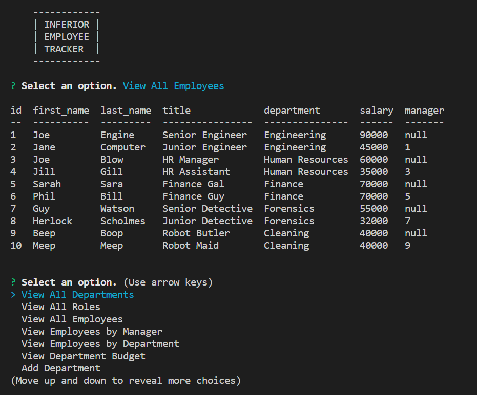

# Inferior-EmployeeTracker
  

  # Description
  
  It is a content management system for managing a company's employee database using MySql via Node.js NPM package mysql2. The NPM package Inquirer is used to ask for user input.

  # Table of Contents
  
  - [Installation](#installation)
  - [Usage](#usage)
  - [Tests](#tests)
  - [Questions](#questions)

  # Installation
  
  Node.js needs to be installed and then the following NPM packages: mysql2, inquirer and console.table.

  # Usage
  
  
  
  

  # Tests
  
  No tests were run.

  # Questions
  
  You can find my GitHub profile at: https://github.com/r134x7

  If you have any questions, you can contact me by email: r134x7@gmx.com

